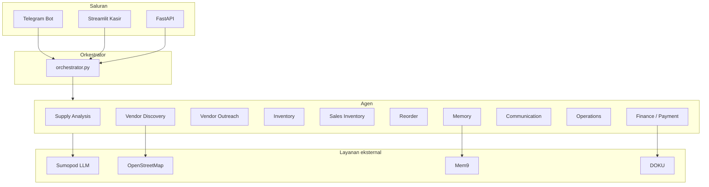

# COOPilot

**COOPilot** adalah asisten operasional berbasis AI untuk usaha kecil (toko kopi, warung, bakery, dll.). Sistem ini membantu onboarding bisnis, menemukan supplier di sekitar lokasi, mengelola stok, memproses penjualan dari kasir, dan menyiapkan pembayaran vendor — terutama lewat **Telegram**, dengan dukungan **dashboard kasir** (Streamlit) dan **REST API** (FastAPI).

> **Penting:** Semua perintah di bawah dijalankan dari folder `coopilot/` (bukan folder induk `AgenthonCOOProject/`).

---

## Fitur utama

| Area | Kemampuan |
|------|-----------|
| **Onboarding** | Jenis usaha, nama bisnis, modal, lokasi (GPS atau alamat teks → geocoding) |
| **Rantai pasok** | Analisis bahan inti → discovery vendor (OpenStreetMap) → outreach → inventory awal |
| **Vendor** | Daftar vendor, dedupe toko sama, tambah manual, cari bahan yang belum punya supplier |
| **Kasir** | Catat penjualan → kurangi stok (BOM via LLM) → auto-reorder + notifikasi Telegram |
| **Keuangan** | Link pembayaran DOKU ke vendor terdaftar |
| **Memori** | Profil & supplier disimpan di Mem9 (cloud) + cache lokal |

---

## Arsitektur



**Alur discovery vendor (`/mulai`):**

1. **SupplyAnalysisAgent** — LLM menentukan daftar bahan inti (maks. 4 kategori, `MAX_CORE_SUPPLIES`).
2. **VendorDiscoveryAgent** — cari toko di OSM per kategori; hindari memilih toko yang sama dua kali.
3. **VendorOutreachAgent** — draft pesan ke vendor, simpan ke registry (dedupe per `osm_id`/nama).
4. **InventoryAgent** — inisialisasi stok awal.

---

## Persyaratan

- Python **3.10+** (disarankan 3.11 atau 3.12)
- Akun & token:
  - **Telegram Bot** ([@BotFather](https://t.me/BotFather))
  - **Sumopod** (atau API OpenAI-compatible) untuk LLM
  - **Mem9** (opsional tapi disarankan untuk memori persisten)
  - **DOKU** (opsional, untuk link pembayaran)
  - **Repliz** (opsional, stub social discovery)

---

## Instalasi

```powershell
cd path\to\AgenthonCOOProject\coopilot

python -m venv .venv
.\.venv\Scripts\Activate.ps1

pip install -r requirements.txt
```

Salin konfigurasi lingkungan:

```powershell
copy .env.example .env
# atau buat .env manual — lihat tabel di bawah
```

Isi `.env` dengan kredensial Anda. File `.env` tidak di-commit (ada di `.gitignore`).

---

## Konfigurasi (`.env`)

| Variabel | Wajib | Keterangan |
|----------|-------|------------|
| `TELEGRAM_BOT_TOKEN` | Ya (bot) | Token dari BotFather |
| `SUMOPOD_API_KEY` | Ya | API key LLM |
| `SUMOPOD_API_BASE_URL` | Tidak | Default: `https://ai.sumopod.com/v1` |
| `MODEL_ORCHESTRATOR` | Tidak | Default: `gpt-4o-mini` |
| `MODEL_SUB_AGENT` | Tidak | Default: `deepseek-v3-2` |
| `MODEL_DEMO` | Tidak | Default: `claude-haiku-4-5` |
| `MEM9_API_KEY` | Disarankan | Memori cloud profil & supplier |
| `MEM9_AGENT_ID` | Tidak | Default: `coopilot-main` |
| `MEM9_BASE_URL` | Tidak | Default: `https://api.mem9.ai/v1alpha2/mem9s` |
| `DOKU_CLIENT_ID` | Untuk bayar | DOKU Checkout |
| `DOKU_SECRET_KEY` | Untuk bayar | |
| `DOKU_SANDBOX` | Tidak | `true` untuk sandbox |
| `CASHIER_CHAT_ID` | Tidak | Override chat Telegram bisnis aktif (kasir) |
| `REPLIZ_ACCESS_KEY` | Tidak | Stub discovery social |
| `REPLIZ_SECRET_KEY` | Tidak | |

Contoh minimal:

```env
TELEGRAM_BOT_TOKEN=123456:ABC...
SUMOPOD_API_KEY=sk-...
MEM9_API_KEY=mem9_...
```

---

## Menjalankan

### 1. Bot Telegram (utama)

```powershell
cd coopilot
python scripts/run_telegram.py
```

Di Telegram: `/start` atau `/setup` → selesaikan onboarding → `/mulai` untuk discovery vendor.

### 2. Backend API (opsional)

```powershell
cd coopilot
uvicorn backend.main:app --reload --host 0.0.0.0 --port 8000
```

- Health: `GET http://localhost:8000/health`
- Docs: `http://localhost:8000/docs`

### 3. Dashboard kasir (Streamlit)

```powershell
cd coopilot
python -m streamlit run dashboard/cashier_app.py
```

Pemilik harus menyelesaikan `/setup` di Telegram dulu. Dashboard memakai `data/active_business.json` atau `CASHIER_CHAT_ID` — **tanpa input Chat ID manual** di UI.

---

## Perintah Telegram

| Perintah | Fungsi |
|----------|--------|
| `/setup` | Onboarding bisnis (4 langkah) |
| `/profile` | Ringkasan profil |
| `/mulai` | Discovery rantai pasok penuh (semua bahan inti) |
| `/tambah_supplier` | Tambah vendor manual (8 langkah) |
| `/cari_supplier` | Discovery hanya untuk bahan tanpa supplier manual |
| `/vendor` | Daftar vendor terdaftar (dedupe toko sama) |
| `/reset_vendor` | Kosongkan vendor di sesi ini (demo ulang) |
| `/stok` | Lihat stok; `/stok <item> <qty>` untuk update |
| `/reorder` | Auto-reorder jika stok rendah |
| `/bayar <nama>` | Workflow pembayaran DOKU ke vendor |
| `/kirim_invoice <nama>` | Kirim invoice ke vendor |
| `/lokasi` | Perbarui lokasi bisnis |
| `/rencana` | Roadmap operasional |
| `/help` | Bantuan perintah |
| `/cancel` | Batalkan wizard yang sedang berjalan |

---

## Demo & reset

Untuk merekam demo dari awal:

```powershell
cd coopilot
python scripts/reset_demo.py
# atau hanya hentikan bot:
python scripts/reset_demo.py --stop-only
# reset vendor cache per chat:
python scripts/reset_demo.py --chat-id <TELEGRAM_CHAT_ID>
```

Di Telegram setelah reset:

1. `/reset_vendor` — kosongkan daftar vendor di sesi bot  
2. (Opsional) Ganti `MEM9_API_KEY` di `.env` dengan key baru agar memori cloud benar-benar bersih  
3. Restart bot → `/setup` atau `/mulai`  
4. `/vendor` — seharusnya menampilkan **beberapa toko unik**, bukan toko OSM yang sama berulang per kategori bahan  

**Catatan Mem9:** setiap `save_supplier` menambah memori di cloud. Dedupe di aplikasi menggabungkan toko dengan `osm_id`/nama sama; untuk demo bersih total, rotasi API key Mem9 disarankan.

---

## Struktur proyek

```
coopilot/
├── backend/
│   ├── agents/           # Agen LLM & logika domain
│   ├── orchestrator.py   # Alur workflow multi-agen
│   ├── main.py           # FastAPI
│   ├── config.py         # Model & MAX_CORE_SUPPLIES
│   ├── business_profile.py
│   ├── supplier_registry.py
│   ├── supplier_discovery.py  # OpenStreetMap
│   ├── vendor_search.py
│   ├── inventory_service.py
│   ├── sales_service.py
│   ├── mem9_client.py
│   └── doku_client.py
├── channels/
│   └── telegram_bot.py   # UI Telegram
├── dashboard/
│   └── cashier_app.py    # Streamlit kasir
├── scripts/
│   ├── run_telegram.py
│   ├── reset_demo.py
│   └── ...
├── data/                 # active_business.json (gitignored)
├── requirements.txt
└── .env                  # tidak di-commit
```

---

## Agen AI

| Agen | File | Peran |
|------|------|--------|
| Supply Analysis | `supply_analysis_agent.py` | Daftar bahan inti bisnis |
| Vendor Discovery | `vendor_discovery_agent.py` | Cari & ranking vendor OSM |
| Vendor Outreach | `vendor_outreach_agent.py` | Draft pesan & registrasi vendor |
| Inventory | `inventory_agent.py` | Stok awal |
| Sales Inventory | `sales_inventory_agent.py` | BOM penjualan → kurangi stok |
| Reorder | `reorder_agent.py` | Trigger reorder stok rendah |
| Finance / Payment | `finance_agent.py`, `payment_agent.py` | Anggaran & DOKU |
| Communication | `communication_agent.py` | Pesan ke pemilik/vendor |
| Operations | `operations_agent.py` | Task operasional |
| Strategy | `strategy_agent.py` | Perencanaan (`/rencana`) |
| Memory | `memory_agent.py` | Konteks Mem9 |
| Social | `social_agent.py` | Repliz (terbatas) |

Orkestrator memilih alur berdasarkan intent (`intent_router.py`) dan perintah Telegram.

---

## Integrasi & keterbatasan

| Integrasi | Status |
|-----------|--------|
| **OpenStreetMap** | Vendor nyata berdasarkan lokasi bisnis |
| **Sumopod LLM** | Analisis, ranking, BOM, pesan outreach |
| **Mem9** | Profil & supplier persisten |
| **DOKU** | Link checkout ke pemilik bisnis (bukan auto-beli ke vendor) |
| **WhatsApp vendor** | Hanya draft pesan; tidak kirim otomatis |
| **Telegram ke vendor** | Hanya jika `telegram_id` vendor diisi |
| **Ecommerce / Repliz** | Stub — perlu API marketplace/search sendiri |

---

## Troubleshooting

| Masalah | Solusi |
|---------|--------|
| `ModuleNotFoundError` | Pastikan `cd coopilot` dan `pip install -r requirements.txt` |
| Bot tidak merespons | Cek `TELEGRAM_BOT_TOKEN`; hentikan duplikat: `python scripts/reset_demo.py --stop-only` |
| `/vendor` masih 10+ duplikat | `/reset_vendor` + restart bot; ganti `MEM9_API_KEY`; jalankan `/mulai` lagi |
| Dashboard kasir kosong | Pemilik harus `/setup` di Telegram dulu |
| `Set SUMOPOD_API_KEY` | Isi key di `coopilot/.env` |
| Streamlit tidak ada | `pip install streamlit` |

---

## Pengembangan

```powershell
# Uji koneksi integrasi
python scripts/test_connections.py

# Validasi fondasi
python scripts/validate_foundation.py
```

---

## Lisensi

Proyek internal / hackathon — tambahkan lisensi sesuai kebijakan tim Anda.
